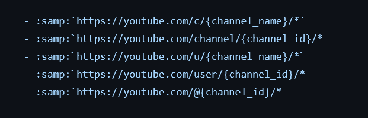
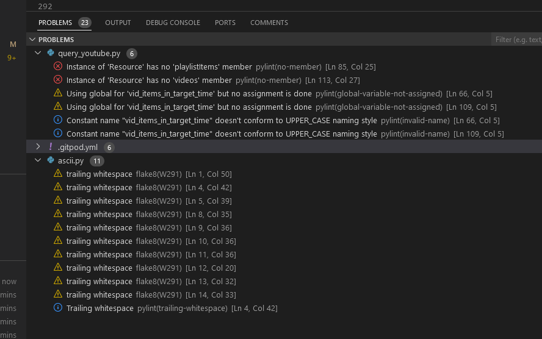
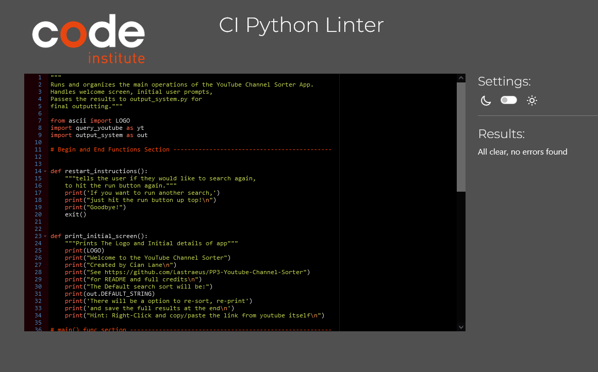
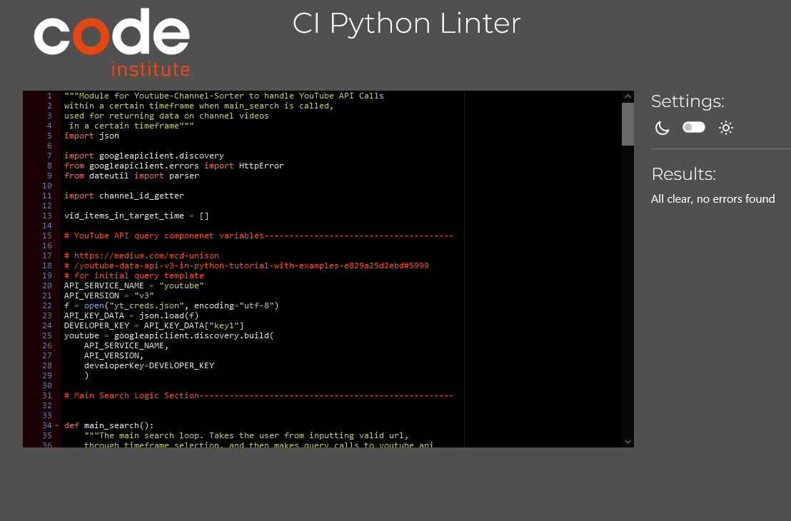
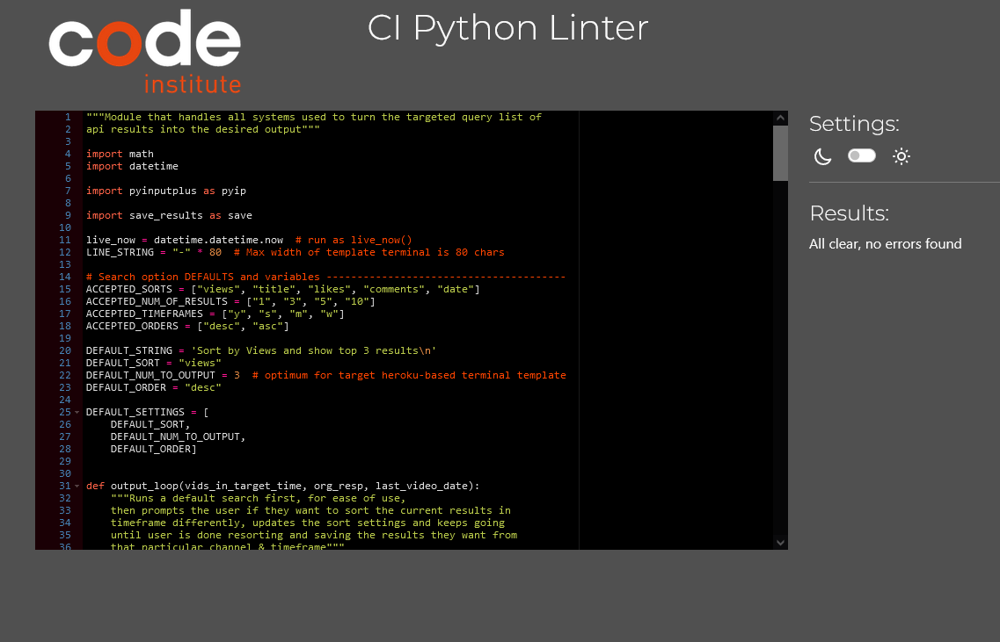
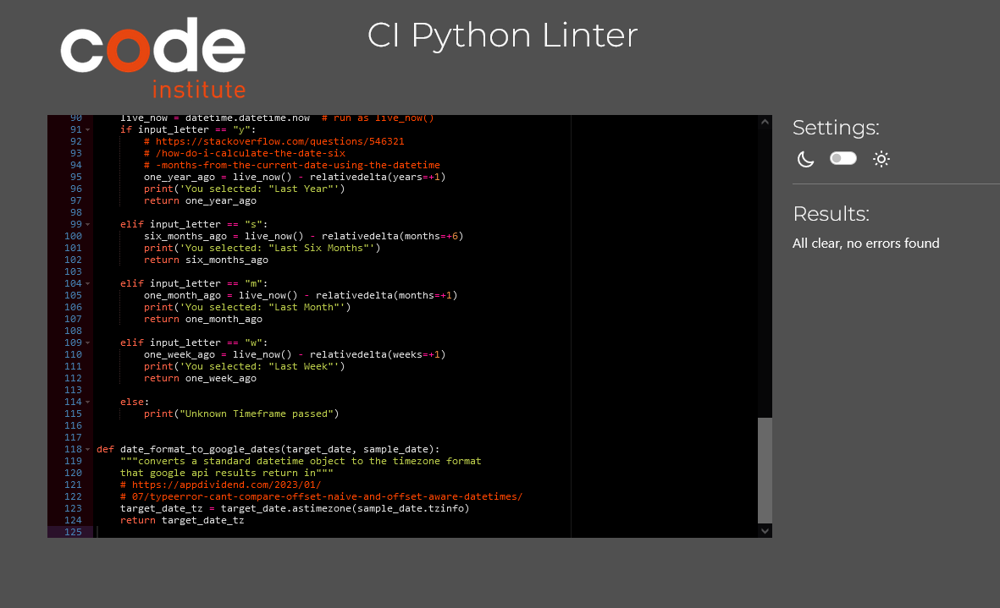
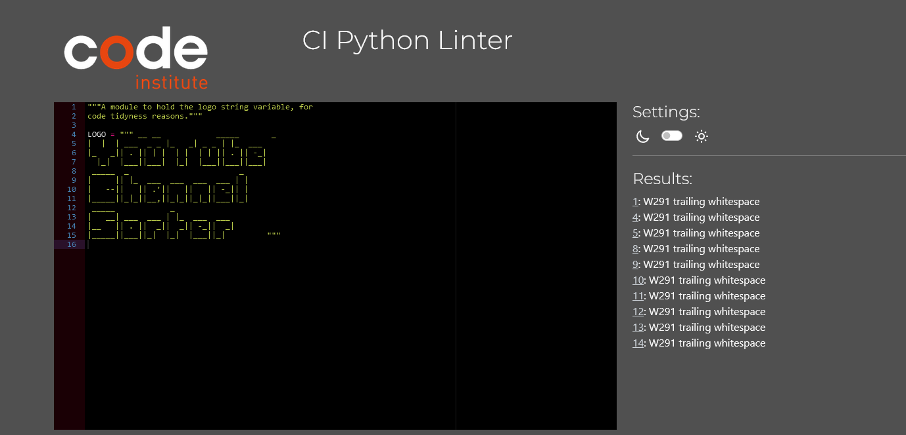
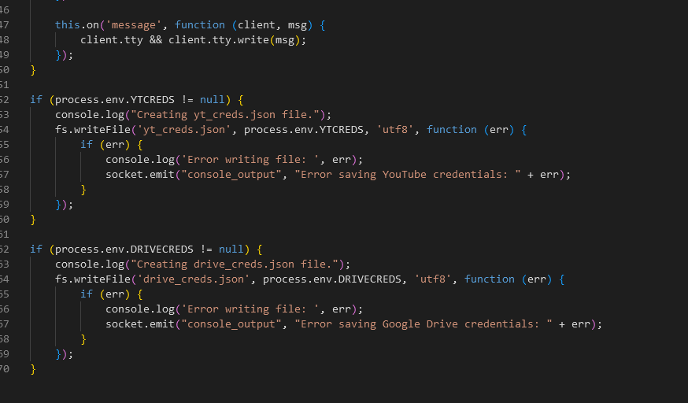

# Youtube-Channel-Sorter - PP3:

## [Link to live website](https://youtube-channel-sorter.herokuapp.com/)

## __Purpose of the Project__
To create a terminal-based app using Python that prompts the user to input a YouTube channel URL and then receive back output of the videos on that channel, sorted (By: Views, Titles, Likes, etc) on a certain timeframe(Last Year, Last Six Months, Last Month, Last Week)

Youtube does not by default allow you to see a channel's top videos within a certain timeframe. You can only sort by;

    "Most recent" 
    
  which requires you to comb through the list yourself for videos with views more than average for the desired period

and

    "Most Popular" 

which will sort every video on their channel back to its inception, by views. The problem being that videos from way back often by default have many more views than more recent ones, biasing results extremely heavily to their older material. 

Often I want to see a highlight of a channel's more modern videos to see the best of their work in its current form.

This lack of functionality has always bugged me, as I use youtube a lot. 

If there is a channel I enjoy, and might have at some point watched frequently, but have missed some weeks/months of its content, I often just want to see "the highlights" video-wise to catch up.

The purpose of this project is to be able to query this application and have it automate this process of searching for you, then output results from both;

  In the terminal

  and

  As a full list of found videos in the timeframe,
  as a text file for the user to peruse or save.

## __Instructions__
Upon opening the web page you are faced with the terminal which upon automatically loading will land on the welcome screen.

The first step to using it is to follow the prompt after the informational text.
"Enter a valid channel URL"

Once the user has done that (preferably by using their right-click menu to paste it in rather than typing, as per the hint)

This link to a channel will then be validated and it will ask for another submission if that channel cannot be found by the system. This validation will go for all inputs.

After a correct channel has been found the user is prompted to select a timeframe.

Only "Y", "S", "M" and "W" (case doesn't matter) can be selected

The user will then peruse the Top 3 results (The default terminal-size-optimum) as some search metadata

The user is then prompted to input a yes/no (‘Yes’, ‘Y’, ‘No’, or ‘N’) case insensitive response to declare if they want to save the results in a text file.

A text file with no user-identifying information is then created in a locked, private google drive and is then printed to the screen after the specific file is made "sharable to those with the link".

The user can then save this link with the mouse and right-click context menu, by highlighting the link first.

They can also open it directly in a new tab.

After they are done with this default set of results (AKA Quick Search) the user is then prompted to re-sort the current results found in the timeframe. They can enter yes/no (‘Yes’, ‘Y’, ‘No’, or ‘N’) case insensitive response.

If they choose "yes"(/"y") they will be prompted with a series of questions to adjust the new sort. (Only affecting the current channel search and timeframe, already loaded.)

In Order these will be 
"Choose Sort By X" 

The user can enter either the value of the selection "views" "TITLE" etc or the index number "1", "2" etc...

"Choose a number of results to display in the terminal" 

The user can enter Eiter "a", "B" etc for the index of the selection, or enter the specific number itself.

and finally, for the last sort option they can choose do they want the results to be sorted Descending (IE Most Views first) or Ascending (IE "A" first then up to "Z")
 

You enter either the index # ("1", "2") or "asc"/"desc".

If the user chose "no" to re-sorting, the program will end with an instruction to run it again to search from the start again, if they want to search a different channel or timeframe, for example.

## __Research & Planning__
__Understanding the Target Problem__

YouTube has this. 

which results in a mess of videos from 10 years ago, but nothing recent.

Reddit has this. 

More choice for users who appreciate it is always good in my opinion though, of course, a good default goes a long way as long as the default is quick, easy, and suits many people's general needs. 

Some apps/sites like Reddit, allow the user to have the quick easy default view and if they want to change it and sort it to their needs or desires then they can.

Other sites, like YouTube, try to railroad users into sticking with "recommended" content as I presume this is more profitable than maximising user experience/benefit. I don't believe that in general, this leads to providing the user with what they __need or want__.

That is the target problem for this project.

__Audience Needs/Stories__

'It's really unfortunate that google doesn't let you sort as Reddit does within a channel'

'When a channel has been running for years, I wish I could sort by the best of their more recent videos.'

'You can sometimes do it by searching the channel name in youtubes own search and using their filters, but oftentimes it gets contaminated with other channels' results and playlists instead of videos, or often the search is just plain missing lots of the videos'

see https://www.youtube.com/results?search_query=%40bbcnews&sp=CAMSAggF and how it runs out of results compared to looking at https://www.youtube.com/@BBC/videos to get an impression of how many there should be.

__Search For Suitable Technologies__

Initially, I investigated [using the official api](https://developers.google.com/youtube/v3) but I deduced that the "search" cost of the official google API quotas for searching with a given API key was quite strict.
https://developers.google.com/youtube/v3/determine_quota_cost

You are only allowed 100 "searches" a day which was possibly too strict for this project's needs during development/testing. Also, there was no clear way [from the documentation](https://developers.google.com/youtube/v3/docs#Channels) to easily turn a URL for a channel into the "channel id" that a lot of the API calls require.

I then investigated [the pytube library](https://pytube.io/en/latest/) and has some bit of success. It had an extremely robust ability to test a channel URL and a handy module that let you pull bits of info. 

I did some rapid prototyping to experiment with this route initially, see the screenshot of my personal replit workspace getting an early version working as a proof of concept.

. 

This turned out to be incredibly slow however as it iterated through about one video a second when some channels can have multiple videos uploading a day, and you want to search back months or more...

I then found https://stackoverflow.com/questions/18953499/youtube-api-to-fetch-all-videos-on-a-channel

and

https://stackoverflow.com/questions/74348727/youtube-data-api-get-channel-by-handle

which led me to piece together a plan of using the official api using the "lists" query, instead, of which you get 10,000 queries per API key, instead of 100. Possibly with a slower pytube library version as a backup. I then settled on combining the use of a single pytube call to its channel.channel_id() method combined with its URL validator, to get the ball rolling with the official API for the purpose of the project.

I also investigated using [this branch of pytube specifically](https://github.com/felipeucelli/pytube)
which had been updated to handle the newer @youtube handles, that came in November 2022.

Also looked at were;

yt-dlp
https://github.com/yt-dlp/yt-dlp which didn't seem to suit my project needs

and 

https://github.com/alexmercerind/youtube-search-python which was deprecated for over 8 months and presumably would have no support for modern URLs

## __Initial Planning__
I  planned a version of the app hosted on Heroku using the Code Institute template for the terminal.

This would wait for the user to enter a channel name and then a timeframe in weeks, months, or years (API Quota Credit Limits, as loose as they are ended up with me limiting the search range to one year, in the end). and then return the top 5 or so results sorted by most popular(views) in that timeframe.

Originally I considered making the results pages be prompted page by page by the user for each batch of 5 or so, as much as the user wanted, if there were enough search hits.

I also planned for a keyword system for the search such as "www.youtube.com/@rte title 20 desc" or "youtube.com/some-example-video-url channelinfo" but splitting a multidimensional keyword argument and developing validation for all permutations, independent of order, seemed beyond the scope of this project needs. 

I came to realize also, that although that could be theoretically more convenient than menus that's only if the user was already familiar with what was possible to input, a large amount of project resources would have needed to be developed to flesh out a then needed "help" page if necessary. (Thank you, Chris Quinn). The plan then became to stick to basic prompts and selectable menus.

I settled on one prompt for URL, and one prompt for the timeframe before beginning the main project, with text output in the terminal and if possible, an option to save results.  I was originally considering saving lists of videos to Google Sheets, but...

 + [space limitations on google sheets.](https://support.google.com/docs/thread/181288162/whats-the-maximum-amount-of-rows-in-google-sheets?hl=en)
 
 
 40000 seems like a lot until you learn that CNN has over 4000 videos uploaded in the last year, Saving such a variable amount of results, to sheets, which I presumed at the time would theoretically need to be continually accessed by the user while they were perusing, or intending to come back to peruse took that off the table for me.

 This was later replaced with the secret gdrive link filesharing method which made it into the plan for the project in its earlier drafts, thankfully.

## __Features__
  * Input any valid channel URL in a number of formats. Pytube validates any of the following types of youtube URLs. Samples from [pytube library code](https://github.com/felipeucelli/pytube/blob/master/pytube/extract.py) below
  
  I also discovered that it allows you to type /@RTE or /@scottmanley and it will accept the new @ handles as long as they are preceded by a forward slash.

  * Select one of four timeframes. Last Year, Last Six Months, Last Month, Last Week to bound the search to. Keeps api query quotas in check.

  * View a default search configuration (Top 3 Most Viewed Results) in a selected timeframe quickly.

  * Results have Title, Views, Published Date, Likes, Comments, and finally a copy-able link to the video itself.

  * Ability to save a full list of videos in the timeframe, in the current sort configuration, to a text file.

  * That result text file is provided to the user via a private google drive file link, unique to each search result.

  * Loading Messages for API sequence and google drive upload, so the user is assured the app hasn't crashed when working with large result pools.

  * Option to re-sort the collected results after initial default viewing. Options are outlined in the instructions above.

  * Graceful exit when a user is done sorting and replies so to the prompt.

  * Across-the-board input validation, requires a user to only progress with an acceptable input.

  * Graceful exit prompt for CTRL-C keyboardInterrupt mishaps, as people love using that shortcut to copy-paste, while still leaving purposeful force-quits possible, in case of hangs.

  * Sparse use of the quota limits allows this project to have no trouble with the project scope. Uses 2 credits per batch up to 50 videos, instead of 100, by using less efficient api "search" queries.

  * Python code has been broken into separate modules for readability and ease of reuse.

### __Technology Used__

1.  Python
Programming Language used to write the app.                 
2.  HTML/CSS/JS/Other Template provided by Code Institute for this Portfolio Project               
https://github.com/Code-Institute-Org/python-essentials-template
3.  Heroku        https://heroku.com/
Used to host the live template/ the actual live site.  
4.  GitHub              https://github.com/
Used as a repository for the project                        
5.  GitPod            https://www.gitpod.io/   
Used as the VDE of the project.                             
6.  Firefox             https://www.mozilla.org/en-US/firefox/new/
Used as the main browser of the project (Browsing, Editing, Screenshot capabilities)     
7.  Chrome              https://www.google.com/intl/en_ie/chrome/
Used as alt browser of the project (Testing)             
8.  MSPaint        
For additional editing of screenshot images for readme.                                            
9.  Grammarly         https://app.grammarly.com   
Used to Proofread this page                              
10. WordCounter        https://wordcounter.net/character-count
For assistance staying under 50 chars recommended git commit length (until I started using the Gitpod native line counter at the bottom of the page!)
11. https://patorjk.com/software/taag             
ASCII generator for the logo  
12. JSON Formatter      https://jsonformatter.curiousconcept.com/#       
For inspection of JSON files returned from API response queries.
13. JSON Viewer by codebeautify https://codebeautify.org/jsonviewer
Had more options for json viewing. (Item counter!)
14. Google
15. Replit https://replit.com/ used for rapid prototyping at project inception to prove the concept was doable.

### __Possible Future Features to Implement__
Ideas for future possible features include;

*  [colorama](https://pypi.org/project/colorama/) supports highlighting parts of the terminal output.

* Save to JSON/CSV/excel possibly with [pandas library](https://pandas.pydata.org/docs/reference/api/pandas.DataFrame.to_excel.html?)

* Wider URL support, for different query types. Eg Input video links, to get channel data. Input playlist links to sort the playlist similar to the channel.*

* Option to frontload the search with all specific query settings (Num results, Sort by Titles, Order Ascending, etc)

* Better incremental terminal updates indicating videos found so far in large searches etc.

## __Testing__
### __General Testing Process__
Primary testing through the development process was done via the Gitpod python terminal.
    python3 run.py
to launch the apps main() function. Upon saving changes in gitpod, I would iterate through the project seeking specific confirmation that the new changes had taken effect. I would periodically load the live site on Heroku to test further.

I would then test to see that changes reflected design intent. (IE check newly added features work, print statements are formatted correctly, calculations tally correctly, results make sense in general, files are created correctly, etc.)

Inspecting any unexpected or hard-to-diagnose bugs with choice print() statements to debug specific variable values at specific times in the code. I found this pretty effective at tracking down where queries were returning none etc.

The result of testing each and every part of the app was deemed satisfactory when the user received:
    - confirmation that the app formatting is as the design intended. 
    - confirmation that the app features are fully functional. 
    - confirmation that the app results are sufficiently useful for the user's needs.
    - confirmation that the app is appropriate for higher organizational goals.

### __Hardware__
This application was tested primarily tested using;
  * my Desktop PC (Windows 10 1440p widescreen monitor) (Firefox & Chrome)
  * My Google Pixel 6a Phone (firefox)

### __Software__

The application was tested with:

Up-to-date Firefox (Windows 10), Up-to-date Chrome
My success learning the ropes practically with the debug tools native to the gitpod workspace was limited. I most debugged via print() statements.

I used the inbuilt "PROBLEMS" feature in gitpod to constantly clear down outstanding issues.  the only outstanding serious items are "Instance of 'Resource' has no 'playlistItems' member" x 2. These relate to the fact that the "playlistItems" and "videos" members are generated dynamically at runtime when connecting to the google API servers. They are working as intended. The "vid_items_in_target_time" issues will be discussed in the Bugs Encountered Section below. The Ascii is working as intended, there just is a lot of whitespace in ASCII variables.

### __Validator Testing__
All 5 python files were validated with the code-institute pep 8 linter       Only the ASCII module failed, due to its nature of having "whitespace trailing". All others had no errors shown.

### __Bugs Encountered__
 __1.__ 
"Global" use of "vid_items_in_target_time" was the only way I could find to solve a re-occurring recursion bug (yes, I know) that was related to how I previously had a function ask the user at the end if they wanted to search again and then looping back to the start. Before splitting the modules apart, many functions relied on global variables declared at the root of run.py. and for instance, used the .append() method or, simply called from them. When functions were wrapped into self-contained modules, a lot of these calls were broken, producing None-type objects, causing tricky-to-solve behavior. I eventually, containerized all found instances in new self-contained looping functions, except for the final one which was only solved by a combination of global variables and cutting out the possibility for further recursion by forcing the program to end after the re-sorting phase. The bug at the time involved the previous result items not being wiped from the global list appropriately and so they poisoned new search results.

I encountered a bug when splitting the creds submitted to Heroku. I removed the CREDS config vars setting as I believe I needed to have two separate creds files, one for youtube (an API key) and one for a drive (a service_key). I made the two creds files and renamed their config vars settings on Heroku YTCREDS and DRIVECREDS for clarity. I updated controllers/default.js as follows  and removed the creds config vars setting on Heroku and replaced it with the two mentioned above. Upon committing and rebuilding, the whole app failed to load at all on Heroku. Eventually, I put creds back in with a placeholder key, as well as the two other creds into the settings, following creds (and PORT = 8000) which I didn't remove, and then it just worked. I presume having a CREDS file is more important than I was aware of.

Other than that, it was mostly standard issues like positional arguments being passed to a function in the wrong order or failing to correctly capture a returned variable and many many indentation errors.

### __Unfixed Bugs__
None that I'm aware of at present.

## __Deployment__
Gitpod
The site was developed using Gitpods Browser Workspace. This was done by:

1. Creating an account with GitHub and creating a GitHub repository with the project name.

2. Navigate to the Gitpod browser extension and install it. I used the firefox version

3. Navigate to [this project repository](https://github.com/Code-Institute-Org/python-essentials-template) and use the new green "gitpod" button to create a workspace based on the repository.

4. Select "more options" and then "open in browser". This will lead you to the workspace after initial loading.

Google APIs
I secured API keys for use in creds files to make API queries to official google servers.
The steps were;
1. Create a google account for the project. (Cleaner)
2. Navigate to https://console.developers.google.com/
3. Create a new project, inputting only the necessary details
4. use the top search bar to find YouTube Api V3 and click it.
5. Enable it.
6. Hit the burger icon. (top left)
7. Make sure you navigate specifically to "Enabled Apis and Services" and then to the credentials selection.
8. Generate an API key and use the option provided to save it as JSON. rename it to something like yt_creds.json
9. repeat steps 4, 5, 6, and 7 for Google Drive.
10. Generate a "service key" and save it.
11. navigate to the google drive folder you want to use.
12. Click Add permissions and provide the email from your new drive service key file.
13. Load both files into your gitpod workspace.
14. Add them to gitignore immediately.
15. import json and use JSON.load() to open your files and pass the relevant data to your API calls as per API documentation.

Heroku
1. Create a free https://heroku.com/ account, and validate it (You may want to investigate your organization's student credits policy if you have access to any)
2. Set password after validating email. 
3. On the Heroku Dashboard default screen, click "create app"
4. go to the settings screen and down to the config vars section.
5. Add a "CREDS" var and as the arg add your credentials if you have any. I would recommend trying to stick to one set of creds and one file if possible.
6. Add a "PORT" var and give it the arg 8000.
7. if you are using custom additional creds, add the lines of code I screenshot above in "bugs encountered" to your controllers/default.js file in get pod.
8. Add the custom var names and args to the heroku.com settings page as above for CREDS.
9. click "add buildpacks" and add python and node.js in that order with python on top.
10. Move to the deployment tab
11. Enable automatic deploys, then this time, hit the manually deploy page.
12. When it's finished, click the "open the app" link and view your template page.

## __Credits__
Chris Quinn - My Code Institute Mentor for this project, was enormously helpful with his insights and adapting so well to my particular set of needs with this project. His critiques, reviews, debugging tips, and general good spirit were a huge part of the reason this project crossed the finish line in one piece. Many Thanks, Chris!

[Automate The Boring Stuff by Al Sweigart](https://automatetheboringstuff.com/) taught me most of what I know about python. I need to finish that book, it's amazing!

__Code__

Query template from https://medium.com/mcd-unison/youtube-data-api-v3-in-python-tutorial-with-examples-e829a25d2ebd#5999

Replacing the "C" in a Channel ID with "U" so that it becomes the "Channel Uploads" playlist (All the videos on the channel). Needed for the 
https://stackoverflow.com/questions/41752946/replacing-a-character-from-a-certain-index

main func reference https://realpython.com/python-main-function/

### __Content__
__Text Content__
I wrote all blurbs and app print() content and this README

### __Media__
All images in this README were taken by me. No other images were used.

__Other__
ASCII Logo generated with [this site](https://patorjk.com/software/taag/#p=display&h=0&v=1&f=Rectangles&t=YouTube%0AChannel%0ASorter) which is, unfortunately, throwing a server error at the time of writing. It was very useful and easy to use though!

__Misc Code Syntax References etc:__
datetime #1 https://java2blog.com/check-if-date-is-greater-than-today-python/

datetime #2 https://stackoverflow.com/questions/63513596/python-get-same-day-last-year

datetime #3 https://stackoverflow.com/questions/546321/how-do-i-calculate-the-date-six-months-from-the-current-date-using-the-datetime

datetime #4 https://appdividend.com/2023/01/07/typeerror-cant-compare-offset-naive-and-offset-aware-datetimes/
check the file on drive https://docs.iterative.ai/PyDrive2/filemanagement/#get-files-by-complex-queries

create a new file on drive https://docs.iterative.ai/PyDrive2/pydrive2/#pydrive2.drive.GoogleDrive.CreateFile

datetime in specific format https://stackoverflow.com/questions/7999935/python-datetime-to-string-without-microsecond-component

justify https://www.tutorialspoint.com/python/string_rjust.htm

switch statement for timeframe choice https://www.freecodecamp.org/news/python-switch-statement-switch-case-example/

itemgetter https://stackoverflow.com/questions/72899/how-do-i-sort-a-list-of-dictionaries-by-a-value-of-the-dictionarygit 

get views https://github.com/CoreyMSchafer/code_snippets/blob/master/Python/YouTube-API/03-Most-Popular-Video-Playlist/start.py

handle API errors https://stackoverflow.com/questions/23945784/how-to-manage-google-api-errors-in-python

divide the list into chunks (for video queries using vidID lists more than 50 items long) https://www.geeksforgeeks.org/break-list-chunks-size-n-python/

playlist not found and other error handling https://stackoverflow.com/questions/23945784/how-to-manage-google-api-errors-in-python

textfile https://www.pythontutorial.net/python-basics/python-create-text-file/

make the output as one string for writing to file or printing
https://flexiple.com/python/python-append-to-string/

check type is a list, not json https://www.geeksforgeeks.org/python-type-function/

leading zeros for output https://www.delftstack.com/howto/python/python-leading-zeros/

pydrive2 for permission sharing https://docs.iterative.ai/PyDrive2/filemanagement/#insert-permissions

use service account https://github.com/iterative/PyDrive2/issues/21

py input plus https://pypi.org/project/PyInputPlus/

upload to drive from existing file https://harshmaur.com/how-to-use-pydrive2-to-upload-a-file-to-google-drive-folder

reference for basic pydrive2 use https://stackoverflow.com/questions/46562255/python-upload-my-own-files-into-my-drive-using-pydrive-library

RE linter warning about missing dynamically created attribute on google service API call https://stackoverflow.com/questions/35990313/avoid-pylint-warning-e1101-instance-of-has-no-member-for-class-with-dyn/54156144#54156144